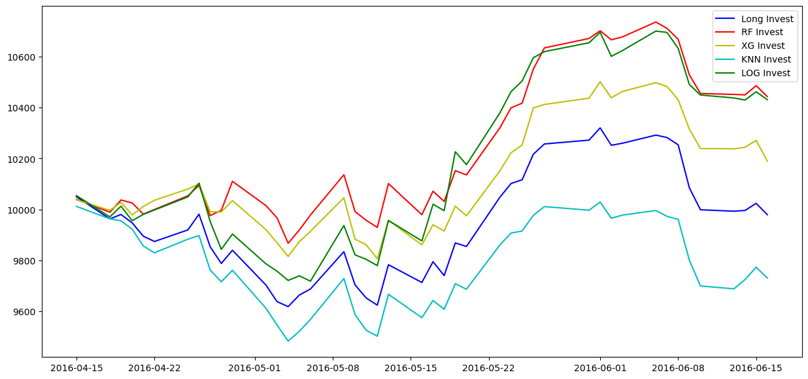
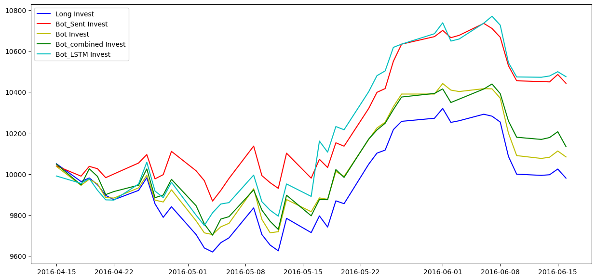
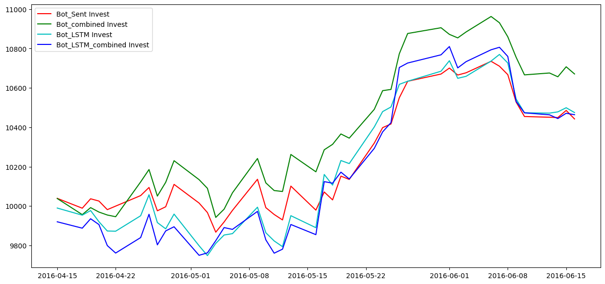

The project is made up by 3 parts: 
1. NLP_stock: This file shows how we train the best model among (Baseline Vader/Naive Bayes/BERT) for sentiment classification. 
  
2. Sentiment_Stock_Dataframe_Generator: This file shows how we do sentiment analysis based on tweet data and stock data. 
  
3. models: This file shows how we train different model based on the sentiment_stockprice data. We used (Random_Forest/LSTM/log_regression/XG_boost/KNN). We designed bot trading techniques which at most outperformed 5% income.

Some bonus part in (3):  
1. Can we categorize stocks regarding to their best fitting model based on their trading history?  
2. Sometimes people like to spread fake news on twitter to get benefits on others, what if we design a trick to avoid this kind of influences? 

Here are the resources of data:
For BERT model training, we have https://www.kaggle.com/datasets/yash612/stockmarket-sentiment-dataset
For the tweets data of the stock, we have https://data.world/kike/nasdaq-100-tweets
We use stock data from YahooFinance.
